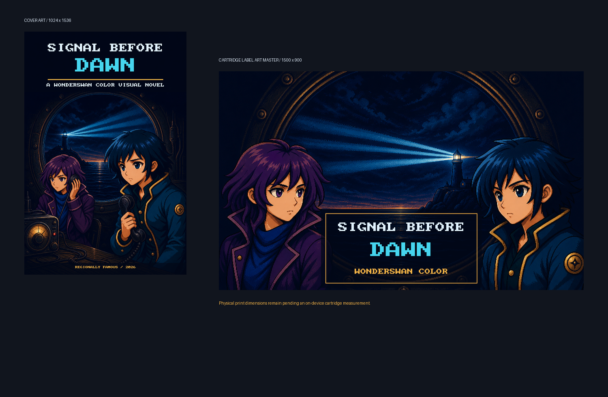

# SwanSong Story Forge

> Tiny screens. Big stories. Real cartridges.

## Put a whole little world in your pocket

SwanSong Story Forge is a workshop for making original visual novels for the
WonderSwan Color.

Write a mystery. Draw a cast. Make a choice matter. Add a song that gets stuck
in somebody's head. Then turn the whole thing into a real game for one of the
most charming handhelds ever made.

<p align="center">
  
</p>

<p align="center">
  <a href="#welcome-to-the-forge">Meet the Forge</a> ·
  <a href="CURRENT_RELEASES.md">Browse the Game Shelf</a> ·
  <a href="#make-something-tiny">Make Something Tiny</a> ·
  <a href="https://github.com/RegionallyFamous/SwanSong-Desktop/wiki">Open the Workshop Manual</a>
</p>

## Welcome to the Forge

This is a weirdly serious workshop for delightfully tiny games.

Story Forge helps you:

- turn a good premise into a causal, revised, reader-tested little story;
- give characters expressions, poses, blinks, and something worth saying;
- make choices that actually change what the player sees;
- add crunchy handheld music and sound;
- finish with a WonderSwan Color game you can play, share, and keep improving.

It also includes a reusable
[series-summary visual-novel lane](docs/series-summary-visual-novels.md): three
proposal-only Agent Builder specialists turn a locked episode continuity into a
causal script, ImageGen production set, story-serving audio design, and
exhaustively tested SwanSong cartridge without pretending that a recap grants
distribution rights.

It comes with original games, reusable art workflows, story-building tools, and
enough guardrails to stop your dramatic final scene from turning into scrambled
pixels.

## Forge the novel before the cartridge

The reusable light-novel framework keeps story quality separate from build
quality. Schema v3 adds causal scene cards, typed continuity, scene-delivery
evidence, genre and series contracts, relationship chemistry, signature moments,
reader-feedback synthesis, rights lanes, optional soundtrack bibles, ImageGen-only
production art with full-set review, nine editorial passes, a 15-part scorecard,
catalog originality/status tools, project lockfiles, and full-book EPUB/PDF
preflight tied to exact manuscript, report, art, and music hashes.

Its Story Room adds eight proposal-only specialists, visual causal and Narrative
Pulse maps, live scene context, immutable revision branches, spoiler-free and
live-bookmark Reader Labs, research and authenticity notes, deeper genre checks,
an ImageGen Art Room, a fun four-channel Music Room, and a source-mapped
WonderSwan adaptation bridge with SwanSong-backed Story Proof and Story Ribbon.
The human lead writer still makes every merge and approval decision.

```bash
python3 scripts/create_light_novel_project.py my-story --title "My Story" --genre-profile mystery
python3 scripts/forge.py next novels/my-story/novel.json
python3 scripts/forge.py story-room novels/my-story/novel.json
python3 scripts/forge.py story-map novels/my-story/novel.json
python3 scripts/check_light_novel_project.py novels/my-story/novel.json --stage concept
python3 scripts/lock_light_novel_project.py novels/my-story/novel.json
python3 scripts/build_novel_release.py novels/my-story/novel.json
```

Automation catches missing or suspicious work; it never declares itself a
great novelist. A prose release still needs a real human approval. See
[the light-novel framework guide](docs/light-novel-framework.md), read the
[story-quality research and product response](docs/story-quality-research.md),
or build the
honest six-scene reference project with
`python3 examples/reference-novel/build_reference.py /tmp/story-forge-reference`.

## The tiny-screen rule

The WonderSwan Color screen is small. That is the fun part.

Every face has to read. Every background needs a focal point. Every line of
dialogue has to earn its room. A branch should change the mood, the picture, or
the player's understanding—not merely send them to a differently numbered box.

If a character turns to oatmeal at actual size, we fix the art. We do not ask
the player to squint harder.

## Stories already on the shelf

The Forge already contains a small library of original adventures: a lighthouse
mystery, bookstore stories, strange catalogs, pocket harbors, cartridge shops,
and other quiet places where something is definitely a little off.

They are playable examples, visual references, and excellent things to take
apart while making a story of your own.

[See what is currently on the shelf →](CURRENT_RELEASES.md)

## The six-beat recipe

1. **Promise** a specific experience and emotional question.
2. **Cause** each scene with the consequence of an earlier one.
3. **Delight** with chemistry, signature moments, genre pleasure, and surprise.
4. **Revise** with evidence, unprimed readers, and no filler shortcuts.
5. **Draw** the locked story with ImageGen for the page or real tiny screen.
6. **Play or proof** the exact EPUB, PDF, or cartridge build you will ship.

That is the whole philosophy. The machinery exists to protect the story, not
the other way around.

## Make something tiny

Story Forge now lives inside SwanSong Desktop. Clone the desktop repository and
ask the Forge how it is feeling:

```bash
git clone https://github.com/RegionallyFamous/SwanSong-Desktop.git
cd SwanSong-Desktop/StoryForge
python3 scripts/doctor_story_forge.py
```

Then try building one of the included games:

```bash
python3 scripts/build_wscvn_game.py soft-click-sunday
```

That is the short version. The
[Story Forge guide](../docs/wiki/Story-Forge.md)
has the toolchain setup, while the rest of the
[technical wiki](https://github.com/RegionallyFamous/SwanSong-Desktop/wiki)
holds the glorious details about art, audio, story files, testing, and releases.

## Forge it here. Play it there.

[SwanSong Desktop](https://github.com/RegionallyFamous/SwanSong-Desktop) is now
the native home of Story Forge. The complete authored workshop lives in this
`StoryForge/` directory; the signed app carries a small hash-verified copy of
the fixed writing framework and keeps personal projects in folders you choose.

When it is time to release both together, the
[SwanSong Desktop release guide](https://github.com/RegionallyFamous/SwanSong-Desktop/wiki/SwanSong-Desktop-Release-Lane)
keeps everybody honest about what was played, what was tested, and what still
needs a real human with a real handheld.

## House rules

- Make original and homebrew games. Commercial ROMs do not live here.
- Keep the source art, even the strange early versions. Yesterday's mistake is
  tomorrow's comparison sheet.
- An emulator test is useful. A real WonderSwan test is different. We say which
  one we actually did.
- Graphics are not decoration added after the game works. They are the game.

## Come make something strange

Make it small enough to finish. Make it readable at arm's length. Give it one
image, one choice, or one melody that refuses to leave.

Then put it in somebody's pocket.
